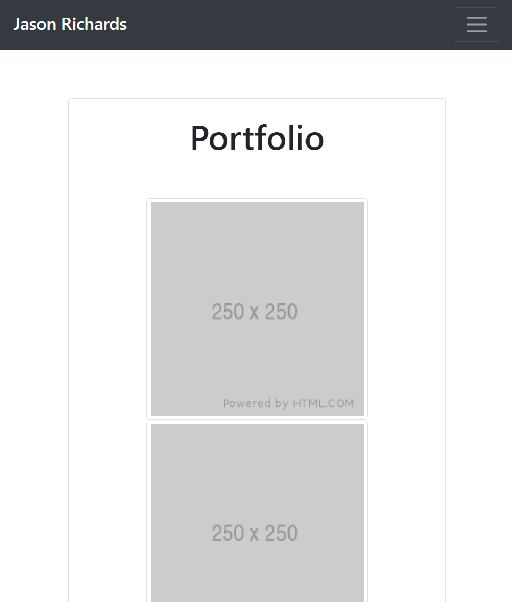

# Bootstrap Portfolio

## About The Repository

The purpose of this repository is to present my portfolio of work. I utilized bootstrap to create a resposive home, portfolio, and contact page. These pages were created utilizing the grid provided by Bootstrap. Each page has a consistent header and a sticky footer.

## Website Mock

Website URL: https://jrkrichards.github.io/Portfolio/

### Full Screen:

Home Page:

Portfolio Page:

Contact Page:

### Pages Responsive:

  
   
  

